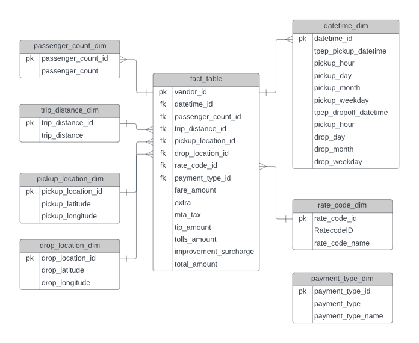

# Cab Data Analysis - Data Engineering

### Overview

In this project, we perform data analytics on Uber data using various tools and technologies including GCP Storage, Python, Compute Instance, Mage Data Pipeline Tool, BigQuery, and Looker Studio.

### Softwares and Tools Required

1. [Github](https://github.com)
2. [Lucidchart](https://lucid.app)
3.

### Data Model

